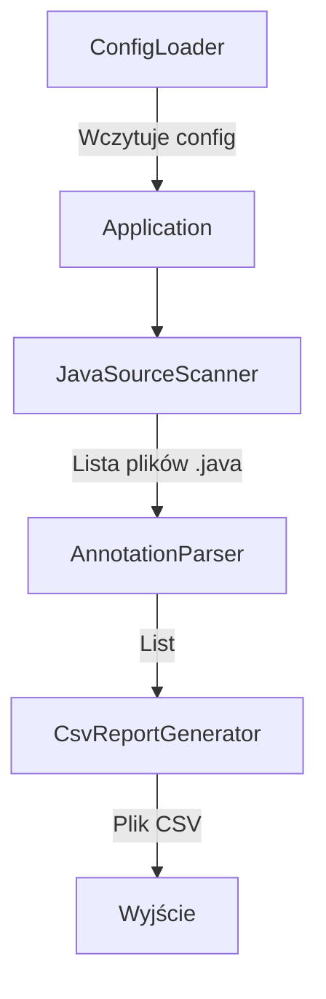

# Allure Scraper - Założenia Projektu

## Cel projektu
Stworzenie narzędzia w Javie do analizy kodu źródłowego testów automatycznych i ekstrakcji danych z adnotacji Allure (`@Issue`, `@Description`). Wygenerowanie raportu CSV zawierającego wszystkie testy z podziałem na numery ticketów JIRA i opisy.

## Format danych wejściowych
- Pliki źródłowe Java (`.java`) z testami automatycznymi
- Adnotacje Allure używane w testach:
  - `@Issue` - zawiera numer ticketu JIRA w formacie `ABCD-12345`
  - `@Description` - zawiera opis testu

## Format danych wyjściowych
Plik CSV z kolumnami:
| Kolumna | Opis |
|---------|------|
| `className` | Pełna nazwa klasy (package + nazwa) |
| `methodName` | Nazwa metody testowej |
| `issueKey` | Numer ticketu JIRA (np. PROJ-1234) |
| `description` | Opis testu z adnotacji @Description |

## Architektura rozwiązania

### Główne komponenty



### Opis komponentów

1. **ConfigLoader** - Wczytuje konfigurację z pliku properties/YAML
   - Ścieżka do katalogu z kodem źródłowym testów
   - Ścieżka wyjściowa dla pliku CSV
   - Opcjonalnie: wzorce plików do uwzględnienia/wykluczenia

2. **JavaSourceScanner** - Skanuje katalog w poszukiwaniu plików `.java`
   - Rekursywne przeszukiwanie
   - Filtrowanie plików (opcjonalnie: tylko pliki zawierające "Test" w nazwie)

3. **AnnotationParser** - Parsuje kod źródłowy Java
   - Biblioteka: **JavaParser** (github.com/javaparser/javaparser)
   - Ekstrakcja adnotacji `@Issue` i `@Description` z metod
   - Wyciąganie wartości z adnotacji

4. **TestData** - Model danych (Lombok [@Value](lombok.Value))
   - `className: String`
   - `methodName: String`
   - `issueKey: String`
   - `description: String`

5. **CsvReportGenerator** - Generuje raport CSV
   - Biblioteka: **Apache Commons CSV** lub **OpenCSV**
   - Nagłówki kolumn
   - Obsługa znaków specjalnych i wielolinijkowych opisów

## Konfiguracja

Plik konfiguracyjny `config.properties`:

```properties
# Ścieżka do katalogu z testami (wymagane)
source.directory=./src/test/java

# Ścieżka wyjściowa dla CSV (opcjonalne, domyślnie: ./allure-report.csv)
output.file=./report.csv

# Wzorzec nazw plików do przeszukania (opcjonalne, domyślnie: *.java)
file.pattern=*.java

# Czy uwzględniać podkatalogi (opcjonalne, domyślnie: true)
scan.recursive=true
```

## Zależności Maven

```xml
<dependencies>
    <!-- Parsowanie kodu Java -->
    <dependency>
        <groupId>com.github.javaparser</groupId>
        <artifactId>javaparser-core</artifactId>
        <version>3.25.8</version>
    </dependency>
    
    <!-- Generowanie CSV -->
    <dependency>
        <groupId>org.apache.commons</groupId>
        <artifactId>commons-csv</artifactId>
        <version>1.10.0</version>
    </dependency>
    
    <!-- Obsługa YAML (opcjonalnie zamiast properties) -->
    <dependency>
        <groupId>org.yaml</groupId>
        <artifactId>snakeyaml</artifactId>
        <version>2.2</version>
    </dependency>
    
    <!-- Lombok - redukcja boilerplate kodu -->
    <dependency>
        <groupId>org.projectlombok</groupId>
        <artifactId>lombok</artifactId>
        <version>1.18.30</version>
        <scope>provided</scope>
    </dependency>
</dependencies>
```

## Użycie Lomboka

Lombok będzie używany do redukcji boilerplate kodu w modelach danych i konfiguracji:

- **[@Data](lombok.Data)** / **[@Value](lombok.Value)** - dla klas modelowych (immutable)
- **[@Builder](lombok.Builder)** - dla budowania obiektów konfiguracyjnych
- **[@Slf4j](lombok.extern.slf4j.Slf4j)** - dla logowania

### Przykład modelu z Lombokiem
```java
import lombok.Value;

@Value
public class TestData {
    String className;
    String methodName;
    String issueKey;
    String description;
}
```

### Przykład konfiguracji z Lombokiem
```java
import lombok.Builder;
import lombok.Value;

@Value
@Builder
public class ScraperConfig {
    String sourceDirectory;
    String outputFile;
    String filePattern;
    boolean recursive;
}
```

## Przykładowy format CSV wyjściowego

### Przypadek 1: Pojedynczy @Issue i @Description
```csv
className,methodName,issueKey,description
com.example.tests.LoginTest,shouldLoginWithValidCredentials,PROJ-1234,Weryfikacja logowania z poprawnymi danymi
```

### Przypadek 2: Wiele @Issue nad jedną metodą
```csv
className,methodName,issueKey,description
com.example.tests.UserTest,shouldCreateUser,PROJ-2001,Tworzenie nowego użytkownika
com.example.tests.UserTest,shouldCreateUser,PROJ-2002,Tworzenie nowego użytkownika
```

### Przypadek 3: Issue w bloku @Description
Adnotacja w kodzie:
```java
@Description("""
    PROJ-3001 - Weryfikacja walidacji email
    PROJ-3002 - Sprawdzenie unikalności użytkownika
    """)
```

Wynik w CSV:
```csv
className,methodName,issueKey,description
com.example.tests.RegistrationTest,shouldValidateEmail,PROJ-3001,Weryfikacja walidacji email
com.example.tests.RegistrationTest,shouldValidateEmail,PROJ-3002,Sprawdzenie unikalności użytkownika
```

## Obsługa przypadków brzegowych

1. **Brak adnotacji** - Metody bez `@Issue` lub `@Description` są pomijane
2. **Wielokrotne adnotacje `@Issue`** - Każda adnotacja generuje osobny wiersz w CSV
3. **Issue w bloku `@Description`** - Gdy `@Description` zawiera String block z wieloma issue w formacie:
   ```java
   @Description("""
       ABCD-12345 - tytuł pierwszego zadania
       ABCD-12346 - tytuł drugiego zadania
       """)
   ```
   Parser powinien wyodrębnić każdy ticket JIRA (format `ABCD-12345`) wraz z tytułem do osobnych wierszy
4. **Puste wartości** - Jeśli `description` jest pusty, pole pozostaje puste
5. **Znaki specjalne w CSV** - Poprawna obsługa przecinków, cudzysłowów, nowych linii
6. **Duplikaty** - Zachowanie wszystkich wpisów (bez deduplikacji)
7. **Mieszane źródła issue** - Obsługa kombinacji `@Issue` nad metodą oraz issue w `@Description` (łączenie wszystkich źródeł)

## Plan implementacji

1. [ ] Konfiguracja projektu Maven i zależności (w tym Lombok z Annotation Processor)
2. [ ] Konfiguracja Maven Shade Plugin do budowy Fat JAR (z włączeniem Lomboka)
3. [ ] Implementacja CLI args parser (obsługa `--source`, `--output`, `--config`, `--pattern`)
4. [ ] Implementacja ConfigLoader (obsługa properties/YAML + CLI args z priorytetem CLI > config > defaults)
5. [ ] Implementacja JavaSourceScanner
6. [ ] Implementacja AnnotationParser z użyciem JavaParser
7. [ ] Implementacja IssueExtractor - parsowanie ticketów JIRA z tekstu (format `ABCD-12345`)
8. [ ] Implementacja modelu TestData
9. [ ] Implementacja CsvReportGenerator
10. [ ] Integracja komponentów w klasie Main
11. [ ] Testy z przykładowymi plikami (w tym z issue w bloku tekstowym)
12. [ ] Dokumentacja użycia i przykłady CI/CD

## Dystrybucja i użycie w wielu projektach

Ponieważ scraper będzie używany dla wielu projektów testowych, przewidziane są następujące formy dystrybucji:

### Opcja 1: JAR z zależnościami (Fat JAR)
```bash
# Budowanie
mvn clean package

# Użycie w dowolnym projekcie
java -jar allure-scraper-1.0-SNAPSHOT-all.jar --config=/sciezka/do/config.properties
```

### Opcja 2: Uruchomienie przez Maven Exec
```bash
# Klonowanie repo ze scraperem
git clone <scraper-repo>
cd allure-scraper

# Uruchomienie ze wskazaniem katalogu z testami
mvn exec:java -Dexec.args="--source=/sciezka/do/repo-testowego/src/test/java --output=report.csv"
```

### Opcja 3: Integracja z CI/CD (GitHub Actions/GitLab CI)
```yaml
- name: Generate Test Report
  run: |
    wget https://github.com/user/allure-scraper/releases/download/v1.0/allure-scraper.jar
    java -jar allure-scraper.jar --source=./src/test/java --output=allure-report.csv
  
- name: Upload Report
  uses: actions/upload-artifact@v3
  with:
    name: allure-report
    path: allure-report.csv
```

## Konfiguracja dla wielu projektów

Przykład konfiguracji używanej w różnych projektach:

```properties
# config-project-a.properties
source.directory=/home/user/projects/project-a/src/test/java
output.file=/home/user/reports/project-a-allure.csv
file.pattern=*Test.java

# config-project-b.properties
source.directory=/home/user/projects/project-b/src/test/java
output.file=/home/user/reports/project-b-allure.csv
file.pattern=*.java
```

## Użycie

```bash
# Uruchomienie z domyślnym config.properties
java -jar allure-scraper.jar

# Uruchomienie z własnym plikiem konfiguracyjnym
java -jar allure-scraper.jar --config=scraper-config.properties

# Uruchomienie z argumentami CLI (bez pliku konfiguracyjnego)
java -jar allure-scraper.jar --source=./src/test/java --output=./report.csv --pattern=*Test.java
```
